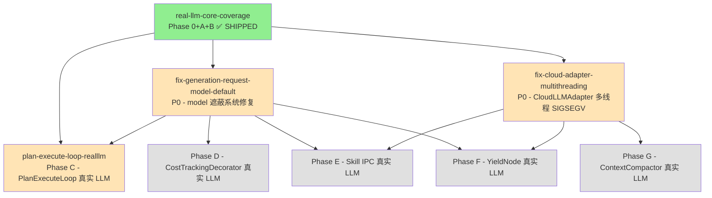

# Real-LLM Followups Roadmap (2026-09-08)

**Generated**: 2026-09-08
**Scope**: 串联 `real-llm-core-coverage` Phase C-G 实施前必须解决的 2 个生产 bug
+ Phase C 首个真实 LLM 测试。共 **3 个 follow-up changes**。

## Overview

`real-llm-core-coverage` Phase A+B ship 后（commit `afc2d1b` + `117850c` + `c0cb522`）
通过 Oracle 审查 + gdb 调试发现两个系统性生产 bug，需要在 Phase C-G 启用真实 LLM
前系统性修复。同时 Phase C 本身（`PlanExecuteLoop` 真实 LLM）也已完成 scaffold。

| # | Change | 状态 | 阻塞 |
|---|---|---|---|
| 1 | `fix-generation-request-model-default` | Draft (scaffolded) | Phase E/G/F 真实 LLM 路径 |
| 2 | `fix-cloud-adapter-multithreading` | Draft (scaffolded) | Phase B B.2 / Phase E/G 多 worker 真实 LLM |
| 3 | `plan-execute-loop-realllm` (Phase C) | Draft (scaffolded) | 依赖 #1（model 墙） |

## 依赖图

## 推荐执行顺序

### Wave 1 — 独立 P0 修复（并行启动, 2-4 天）

| 优先级 | Change | 估时 | 并行性 | 依赖 |
|---|---|---|---|---|
| **1a** | `fix-generation-request-model-default` | ~3 h | 可并行 | 无 |
| **1b** | `fix-cloud-adapter-multithreading` | ~4 h | 可并行 | 无 |

**并行理由**：两个 change 修改不同文件，零冲突。
- #1: 修改 5 个生产站点 + recording provider 单测（`simple_orchestrator.cpp` 已 ship）
- #2: 新增 `SerializingDecorator` + factory 集成 + stress test

### Wave 2 — 依赖 Wave 1 的 Phase C（顺序执行, ~2.5 h）

| 优先级 | Change | 估时 | 依赖 |
|---|---|---|---|
| **2** | `plan-execute-loop-realllm` (Phase C) | ~2.5 h | Wave 1 #1（硬依赖: plan_phase/verify_phase 是 model 遮蔽面之一） |

**依赖说明**: `plan_execute_loop.h:208` (plan_phase) + `:254` (verify_phase)
构造 `GenerationRequest` 不设 `params.model` → Wave 1 #1 ship 前真实 LLM 必撞墙。

### Wave 3 — Phase D/E/F/G（待 Phase C ship 后评估, ~5 天）

依赖 Wave 1 完成（#1 + #2 都 ship）：

- **Phase D** CostTrackingDecorator 真实 token (~0.5 天)
- **Phase E** SkillInterpreter IPC llm_generate (~1 天, 含 token 超时保护)
- **Phase F** YieldNode 流式取消 (~0.5 天, 需补 token 透传)
- **Phase G** ContextCompactor 摘要 (~0.5 天)

### Wave 4 — 后续 fix-up（低优先级, 待评估）

- `fix-yield-node-token-passthrough`（YieldNode token={} 修复, Phase F 触发）
- `fix-orchestrator-token-passthrough`（simple_orchestrator token={} 修复, A.5 记录）
- `fix-skill-interpreter-token-and-timeout`（Skill IPC 超时保护, Phase E 触发）
- ADR-XXXX "Cloud adapter threading model"（`fix-cloud-adapter-multithreading` 方案 B:
  OpenSSL 3.0 + httplib 升级 + 移除 SerializingDecorator 恢复并发）

## 总估时

| Wave | 内容 | 估时 |
|---|---|---|
| 1 | 2 个 P0 follow-up 修复 | 1-2 天（并行） |
| 2 | Phase C 真实 LLM 测试 | 0.5 天 |
| 3 | Phase D/E/F/G | ~5 天 |
| 4 | 后置 fix-up | 待评估 |
| **Total Wave 1+2** | | **1.5-2.5 天** |

## 风险

| 风险 | 概率 | 影响 | 缓解 |
|---|---|---|---|
| `fix-generation-request-model-default` 修复某站点破坏现有 mock 路径 | 低 | 中 | 每站点独立 recording provider 单测 + 全量 ctest 验证 |
| `fix-cloud-adapter-multithreading` SerializingDecorator 性能 trade-off 使某些场景不可用 | 中 | 低 | 性能测试 + ADR 记录 trade-off; 后续方案 B (根因修复) 恢复并发 |
| `plan-execute-loop-realllm` plan_phase LLM 输出无法解析 DSL → 测试 FAIL | 中 | 低 | prompt 调整 + 断言宽松（解析即可, 不验证内容）+ 失败时诊断输出 |
| Wave 3 暴露新的 model 遮蔽站点（5 之外）→ 需追加 commit | 低 | 低 | 已 ship 的 fix-generation-request-model-default 设计支持追加（独立 commit, 静态脚本 grep 兜底） |

## 状态追踪

- [ ] Wave 1 #1 `fix-generation-request-model-default` ship
- [ ] Wave 1 #2 `fix-cloud-adapter-multithreading` ship
- [ ] Wave 2 `plan-execute-loop-realllm` ship
- [ ] Wave 3 Phase D/E/F/G 实施（待 Wave 1+2 ship 后）
- [ ] Wave 4 后置 fix-up（待评估）

## 经验沉淀（已完成）

见 `AGENTS.md` §ENGINEERING PATTERNS（决策层 + 治理层）+ `tests/AGENTS.md`
§REAL-LLM TEST PATTERNS（设计 + 工程层）。含 8 条模式：

- 决策层：测试驱动发现生产 bug 闭环 / 触发升级模式 / 真实 LLM 断言分层 /
  OpenSpec SHIP-with-fixes 流程
- 治理层：跨多树 helper 双维护
- 设计/工程层：Helper 三态 / Recording Provider / SKIP 陷阱 / CMake target 冲突

## 关联文档

- `openspec/changes/real-llm-core-coverage/` — Phase A+B ship（commit `afc2d1b` + `117850c` + `c0cb522`）
- `openspec/changes/fix-generation-request-model-default/` — Wave 1 #1
- `openspec/changes/fix-cloud-adapter-multithreading/` — Wave 1 #2
- `openspec/changes/plan-execute-loop-realllm/` — Wave 2
- `docs/superpowers/plans/2026-07-10-phase5-remainder-adr-sync.md` — 类似 roadmap 模板参考